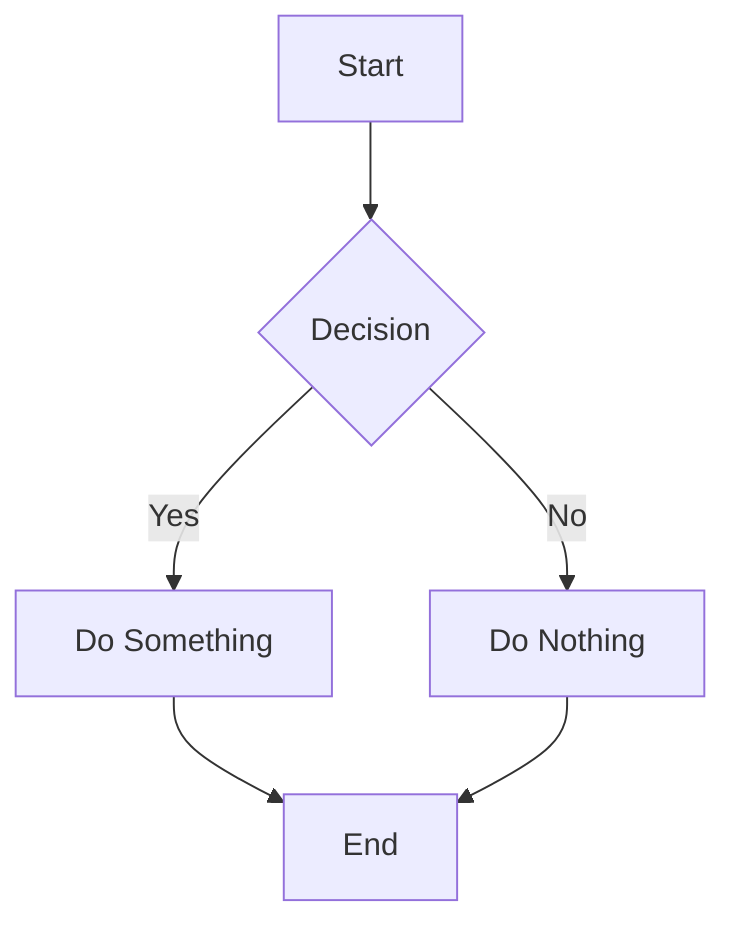

# Markdown Separator Test

This file demonstrates various separator modes for the markdown converter.

---

# Horizontal Rule Separator

This slide is separated by `---` (horizontal rule).

- Default separator mode
- Compatible with Marp and reveal.js

<!-- Speaker note: This is the standard separator used in most slide tools. -->

---

## Second Level Heading

When using `-s heading-2`, this would start a new slide.

### Third Level Content

This stays with the second level heading above.

---

# Mermaid Diagram Example



Use `-p mermaid` to convert this to a mermaid beat type.

---

# Directive Example

<!-- _class: lead -->
<!-- _backgroundColor: #f5f5f5 -->

This slide has Marp-style directives.

Use `-p directive` to remove them.

---

# Code Block Example

```typescript
interface Plugin {
  name: string;
  preprocess?: (md: string) => string;
  toBeat?: (md: string) => Beat | null;
}
```

Code blocks are preserved in markdown output.

---

# Table Example

| Separator | Flag | Description |
|-----------|------|-------------|
| `---` | `-s horizontal-rule` | Default |
| `# ` | `-s heading-1` | H1 headings |
| `## ` | `-s heading-2` | H2 headings |
| blank | `-s blank-lines` | 3+ blank lines |

---

# Final Slide

Test commands:

```bash
# Default (horizontal-rule)
yarn cli markdown samples/markdown_separators.md

# Heading separator
yarn cli markdown samples/markdown_separators.md -s heading

# With mermaid plugin
yarn cli markdown samples/markdown_separators.md -p mermaid

# With style
yarn cli markdown samples/markdown_separators.md --style corporate-blue
```

<!-- End of presentation -->
