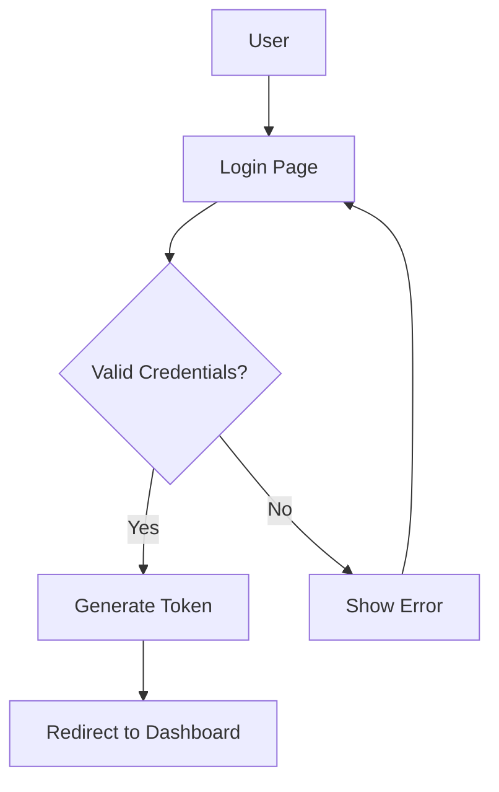
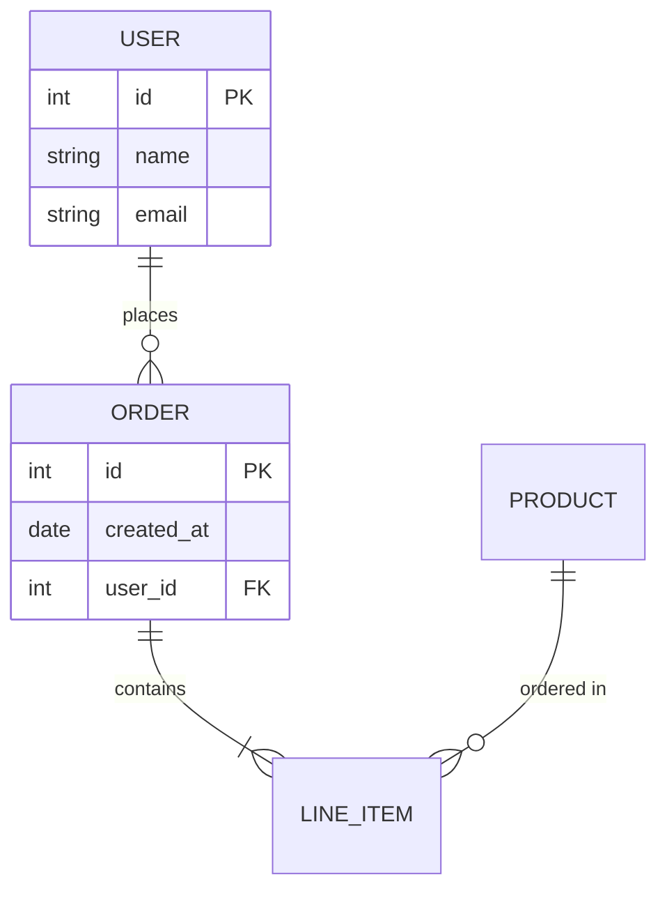
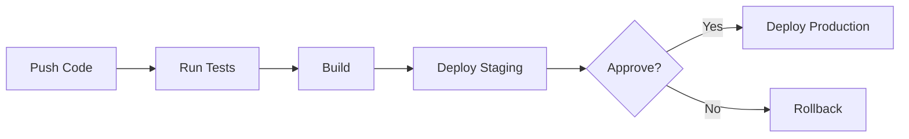

# System Architecture

<!-- Architecture overview with diagrams -->

---

# User Authentication Flow

This diagram shows how users authenticate.

---

# Database Schema

Entity relationship diagram.

---

# Deployment Pipeline

CI/CD workflow.

